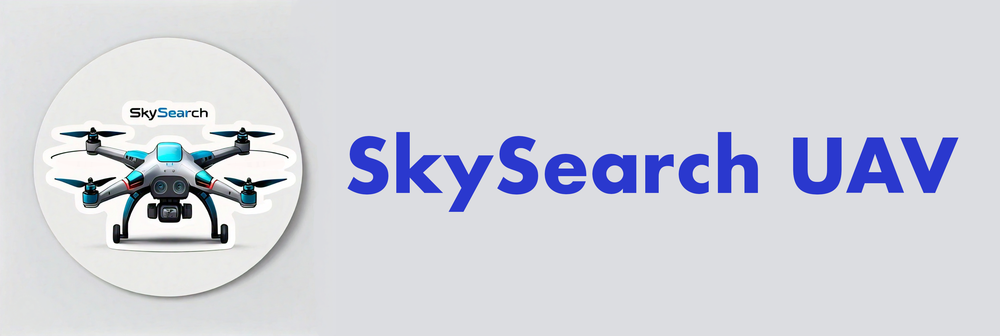

<picture align="left">
  <source media="(prefers-color-scheme: dark)" srcset="media/images/SkySearch_Logos/SkySearchLogo5_WithText.png">
  
</picture>

# SkySearch: Generalized Object Search Using UAVs and Multimodal Models
UChicago Robotics Capstone December 2024

| Authors | Zach Farahany, Duncan Calvert, Joon Park, Mohammad Ayan Raheel |
| --- | --- |
| Package |  |
| Meta | [License - MIT](https://github.com/DonutsDuncan/SkySearch_UAV/blob/main/LICENSE) |

## What is it?
**SkySearch** is a groundbreaking research project that leverages multimodal models to enable drones to autonomously perform open-vocabulary search tasks. Unlike traditional object detection systems constrained by fixed class labels and requiring retraining for new objects, SkySearch empowers drones to locate targets using natural language descriptions or reference images—without additional model fine-tuning.

For example, during a test flight, SkySearch successfully identified the book *Cracking the Coding Interview* when given the target description: "something that can help me with an interview at Meta." By integrating advanced vision-language models like GPT-4o, Gemini 1.5, and Claude 3, SkySearch enables drones to reason about their environment, adapt to dynamic conditions, and identify novel objects in real time. This innovation represents a significant step forward in autonomous UAV capabilities, combining reasoning, adaptability, and precision.

## Table of Contents

- [What is it?](#what-is-it)
- [Main Features](#main-features)
- [Repository Structure](#repository-structure)
- [ArXiv Paper Link](#arxiv-paper-link)
- [PowerPoint Presentation](#powerpoint-presentation)
- [MS in Applied Data Science Conference Presentation](#ms-in-applied-data-science-conference-presentation)
- [License](#license)

## Main Features

- **Open Vocabulary Search**:  
  SkySearch leverages state-of-the-art multimodal large language models to enable drones to perform open-vocabulary searches. This means drones can identify and locate objects based on natural language descriptions or reference images, without being limited to predefined categories or requiring retraining.  
- **Reasoning Based Searches**:  
  SkySearch integrates advanced reasoning capabilities, allowing drones to interpret complex natural language queries and adapt their search strategies dynamically. This feature enables drones to perform tasks such as identifying objects based on abstract descriptions, contextual clues, or even ambiguous instructions, enhancing their utility in real-world scenarios.
- **Custom GLAD Dataset**:
  Due to benchmark data contamination and the fact that we are using an LLM to find images within a grid pattern from our drone's camera, we specially made a new labeled dataset for this purpose. We call it GLAD (Grid Labeling Approximation Dataset). Within this repo, we demonstrate how we tested multiple LLMs over GLAD so we could figure out which one was the best to utilize in our drone's official test flights.

## Repository Structure

The SkySearch repository is organized for modular development, separating drone control logic, vision model utilities, and evaluation datasets. Below is a summary of the major folders and files:

SkySearch/
├── media/images/                      # Project images, logos, and visual assets
├── parameters/                        # Prompt templates and model configuration files
├── setup/                             # Environment and dependency setup scripts
├── src/                               # Main SkySearch application code
│   ├── main.py                        # Entrypoint to run the SkySearch mission
│   ├── LLM.py                         # Shared functions for MLLM integration
│   ├── GeminiLLM.py                   # Gemini-specific model logic
│   └── UAV.py                         # Drone control interface for UAVs like Tello
├── tests/                             # Unit and integration tests
│   ├── uav_test.py                    # Tests for drone command module
│   └── llm_test.py                    # Tests for LLM query/response behavior
├── requirements.txt                   # Python dependencies
├── pyproject.toml / setup.cfg         # Packaging and installation metadata
├── README.md                          # Project overview and instructions
└── .gitignore / .dockerignore         # Ignore rules for Git and Docker

## ArXiv Paper Link

We are in the process of preparing our research paper for submission to arXiv. Once published, the link to the paper will be updated here. Stay tuned for more details!

## Powerpoint Presentation 

We created a detailed PowerPoint presentation to showcase the SkySearch project, including its objectives, methodology, and results. The presentation covers the technical aspects of integrating multimodal large language models with UAVs, as well as the challenges and solutions encountered during development.

You can download the PowerPoint presentation [here](https://example.com/skysearch-presentation).

## MS in Applied Data Science Conference Presentation

SkySearch was presented as part of the MS in Applied Data Science Conference, where it was awarded **1st place** in it's group for its innovative approach to autonomous UAV search and identification. The presentation highlighted the project's groundbreaking use of multimodal large language models and its potential real-world applications.

You can watch the full presentation video [here](https://example.com/conference-presentation-video).

## License

SkySearch is published under the [MIT License](https://github.com/DonutsDuncan/SkySearch_UAV/blob/main/LICENSE)
